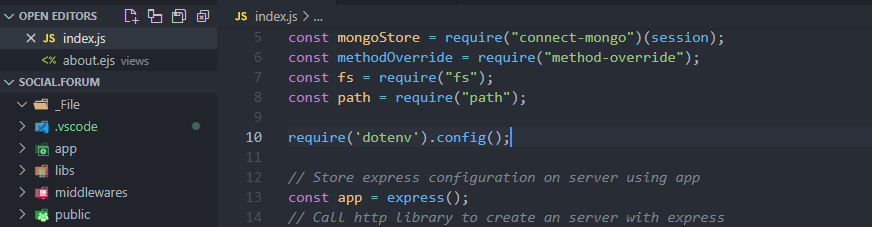

# Social.Forum



This is the BCA 6th-sem project i'm working on.
- 🐱‍🏍 [Live][lnk0001] App

## Setup and run the Project
### ➕ Add .env file in the root directory

```Plain
    PORT=<Input_PORT>
    DB_USER=<Input_DB_USER>
    DB_PASS=<Input_DB_PASS>
    DB_NAME=<Input_DB_NAME>
    SENDGRID_API_KEY=<Input_SENDGRID_API_KEY>
    SESSION_NAME=<Input_SESSION_NAME>
    SESSION_SECRET=<Input_SESSION_SECRET>
```

---

### 🍿 (Optional) One file For Run database server locally

- `cd/` -To go root of your drive
- `D:` -Set drive where mongodb installed
- `<MongoDB_File_with_mongodb_Path> --dbpath=<Your_MongoDB_Data_Path>/`
- Save now and Run Whenever you need.

### 🍿 One file For Start The Server with view Mode in `package.json`

- In terminal type `npm run start` to start the server
- Save now and Run Whenever you need.

### 🍿 One file For Run In Development Mode With #1 [Nodemon] in `package.json`

- In terminal type `npm run dev` to start the server in development environment
- Save now and Run Whenever you need.

<!-- External links -->
[lnk0001]: https://aroot-user-social-forum.herokuapp.com